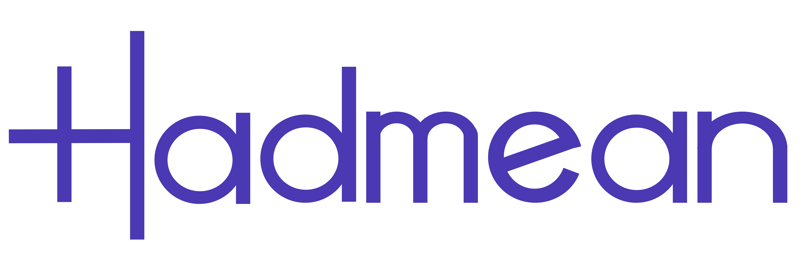

<h1 align="center">
  <a href="https://github.com/hadmean/hadmean">
    
  </a>
</h1>

<div align="center">
  Hadmean
  <br />
  <a href="https://github.com/hadmean/hadmean/issues/new?assignees=&labels=bug&template=01_BUG_REPORT.md&title=bug%3A+">Report a Bug</a>
  ·
  <a href="https://github.com/hadmean/hadmean/issues/new?assignees=&labels=enhancement&template=02_FEATURE_REQUEST.md&title=feat%3A+">Request a Feature</a>
  ·
  <a href="https://github.com/hadmean/hadmean/discussions">Ask a Question</a>
</div>

<div align="center">
<br />

[](LICENSE)
[](https://github.com/hadmean/hadmean/issues?q=is%3Aissue+is%3Aopen+label%3A%22help+wanted%22)

</div>

<details open="open">
<summary>Table of Contents</summary>

- [About](#about)
  - [Live Demo](#live-demo)
  - [Quick Demo](#quick-demo)
  - [Motivation](#motivation)
  - [Why you should try Hadmean](#why-you-should-try-hadmean)
- [Getting Started](#getting-started)
  - [Prerequisites](#prerequisites)
  - [Installation](#installation)
- [Features](#features)
- [Roadmap](#roadmap)
- [Support](#support)
- [Project assistance](#project-assistance)
- [Contributing](#contributing)
- [Authors & contributors](#authors--contributors)
- [Security](#security)
- [License](#license)
- [Built With](#acknowledgements)

</details>

---

## About
Hadmean is a no-code, internal tool generator. It is language agnostic, schema driven, extremely customizable, fully featured, user-friendly and has just one installation step.

### Live Demo
You can play with a live demo at https://hadmean-demo.up.railway.app

Username is `root`

Password is `password`

### Quick Demo

https://user-images.githubusercontent.com/51802801/187038561-73b8a86d-ab97-4efc-97d6-585cc4fb9f00.mp4


### Motivation
There are plenty of admin projects out there usually free or paid.

The free ones are usually tied to a framework and all your experience with it is useless when you hop to your next shiny language. They are usually not aesthetically pleasing and always require a developer to make any change

The paid ones are usually good but very restricted as their free version are usually demo plans for you to get a taste of what they can do and you will have to get to the paywall to get to be usable for your day to day

The primary reason to build Hadmean was to build something that will be free and very usable and language agnostic

### Why you should try Hadmean
- It is free
- Easiest installation, Just one command to install and run
- You will always be running the latest version
- The little learning curve with truly less than 5% technical knowledge requirement
- Tons of features
- Language/framework agnostic
- Lastly, It is open source, It doesn't get more customizable than that

## Getting Started

### Prerequisites
 - [Node.js](https://nodejs.org/en/download/)
 - Supported database (MySQL, Postgres, MsSQL, SQLite)

### Installation

```bash
$ cd <project_name>

$ npx hadmean@latest
```

That is all, You will be able to see the application on http://localhost:3000


## Features
 - One line installation 
 - Authentication
 - Role and Permissions
 - Users management
 - Dashboard builder 
 - CRUD
 - Form validation
 - Powerful form manipulation (hiding fields, disabling fields, editing values before submitting)
 - Relationships
 - Powerful Filters
 - DB Introspection
 - Color Customization
 - Rich text editor
 - Deep navigation
 - Reusable Queries
 - Views
 - Data Count
 - Synced DB Validation
 - Fields selection/ ordering
 - Cache
 - Secure Credentials Storage
 - Forms fields customization
 - Selection Colors


## Roadmap

See the [open issues](https://github.com/hadmean/hadmean/issues) for a list of proposed features (and known issues).

- [Top Feature Requests](https://github.com/hadmean/hadmean/issues?q=label%3Aenhancement+is%3Aopen+sort%3Areactions-%2B1-desc) (Add your votes using the 👍 reaction)
- [Top Bugs](https://github.com/hadmean/hadmean/issues?q=is%3Aissue+is%3Aopen+label%3Abug+sort%3Areactions-%2B1-desc) (Add your votes using the 👍 reaction)
- [Newest Bugs](https://github.com/hadmean/hadmean/issues?q=is%3Aopen+is%3Aissue+label%3Abug)

## Support

Reach out to the maintainer at one of the following places:
- [GitHub Discussions](https://github.com/hadmean/hadmean/discussions)
- Contact options listed on [this GitHub profile](https://github.com/thrownullexception)

## Project assistance

If you want to say **thank you** or/and support the active development of Hadmean:

- Add a [GitHub Star](https://github.com/hadmean/hadmean) to the project.
- Tweet about Hadmean.
- Write interesting articles about Hadmean on [Dev.to](https://dev.to/), [Medium](https://medium.com/) or your personal blog.

Together, we can make Hadmean **better**!

## Contributing

First off, thanks for taking the time to contribute! Contributions are what make the open-source community such an amazing place to learn, inspire, and create. Any contributions you make will benefit everybody else and are **greatly appreciated**.


Please read [our contribution guidelines](docs/CONTRIBUTING.md), and thank you for being involved!

## Authors & contributors

The original setup of this repository is by [Ayobami Akingbade](https://github.com/thrownullexception).

For a full list of all authors and contributors, see [the contributors page](https://github.com/hadmean/hadmean/contributors).

## Security

Hadmean takes security at heart and follows all known good practices of security, but 100% security cannot be assured.
Hadmean is provided **"as is"** without any **warranty**.

_For more information and to report security issues, please refer to our [security documentation](docs/SECURITY.md)._

## Built With
- [KnexJS](https://github.com/knex/knex)
- [React](https://github.com/facebook/react)
- [NextJS](https://github.com/vercel/next.js)
- [Typescript](https://github.com/microsoft/TypeScript)
- [React Query](https://github.com/TanStack/query)
- [React Table](https://github.com/TanStack/table)
- [React Final Form](https://github.com/final-form/react-final-form)
- [Styled-components](https://github.com/styled-components/styled-components)
- [Class Validator](https://github.com/typestack/class-validator)
- [Zustand](https://github.com/pmndrs/zustand) 

## License

This project is licensed under the **GNU General Public License v3**.

See [LICENSE](LICENSE) for more information.
